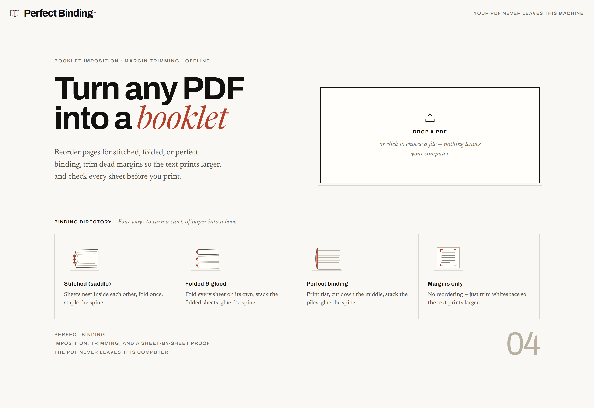
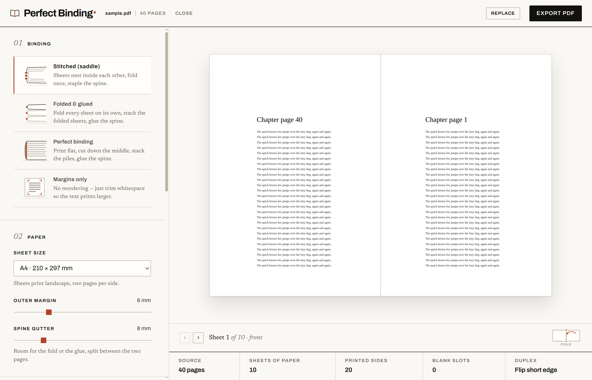
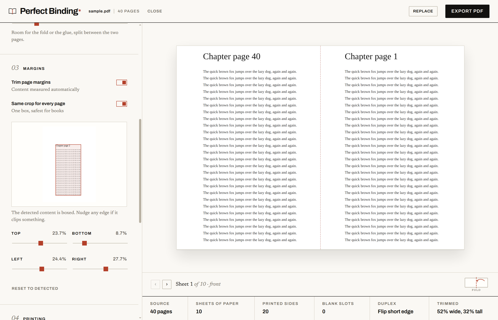

## Problem

Printing a book at home is a page-ordering problem disguised as a printing problem. To staple a stack of A4 down the middle and have it read in order, sheet 1 has to carry the last page next to the first, sheet 2 the second-to-last next to the second, and so on. Get the imposition wrong and you find out after the ink is dry.

The tools that do this are either web uploads (your document goes to someone else's server) or command-line utilities that give you no way to check the result before printing. Academic PDFs make it worse: enormous margins mean the text lands on the page at half the size it could be.

So: a desktop app, offline by construction, that does the imposition, trims the margins, and shows you every sheet before you commit paper to it.

## Approach

Four binding modes, each explained inside the app rather than in a manual. **Stitched (saddle)** nests sheets and pads the page count to a multiple of four, with a signature slider for thick books that would otherwise bulge at the fore-edge. **Folded and glued** is the same imposition with exactly one sheet per signature, so the spine stays square at any length. **Perfect binding** prints a cut stack: sheet 1 carries pages 1 and 1+N/2, you slice down the middle and drop the right pile under the left. **Margins only** skips reordering entirely and just reclaims the whitespace.

Margin detection renders each page small with pdf.js and scans for non-white pixels. Rows and columns with less ink than the noise floor are ignored, which kills scanner speckle and edge shadows. Per-page results merge with a low percentile, so one full-bleed page cannot cancel the crop for the whole document, and every edge stays nudgeable by hand.

The proof view is the part I care about most. Step through every sheet, front and back, with the fold line or cut line drawn where it will actually fall, alongside the numbers that decide the job: sheets of paper, printed sides, blank slots, duplex flip, and how much was trimmed.

## Architecture

`src/core/` is pure logic with no DOM and unit tests around all of it: `imposition.ts` maps page order to sheet sides (signature size 1 falls out as folded and glued), `crop.ts` does whitespace detection over raw pixels, `build.ts` assembles the output with pdf-lib, `paper.ts` holds paper sizes in points. `src/renderer/` is React and hand-written CSS, no framework beyond that. `electron/` owns the main process, the preload bridge, the CSP response header, and the once-a-day update check.

Three constraints shaped the renderer more than any feature did:

- **PDF bytes never travel through React state or props.** React's development build diffs changed props onto its performance track via `performance.measure`, and a multi-megabyte `Uint8Array` there throws `DataCloneError` and then corrupts the commit phase. Bytes live in refs; the preview gets a `blob:` URL and reaches pdf.js objects through callbacks. A dev-build smoke test fails if that regresses.
- **Fonts are bundled and declared in `index.html`.** The CSP is `default-src 'self'` with no `font-src`, so a CDN font is blocked and so is a `data:` font, which matters because Bun's CSS bundler silently inlines small assets it can resolve from a stylesheet. Declaring the faces inline keeps the paths out of the bundler's reach.
- **Canvas renders are cancelled, not stacked.** pdf.js refuses to paint a canvas already being painted, which Strict Mode triggers constantly, so `renderPage` cancels any in-flight task for that canvas first.

CI runs typecheck, tests, and the renderer build on every push. A tag fans out to Linux, Windows, and macOS runners and uploads installers to a GitHub release.

## Tradeoffs

- **Electron instead of a web app.** A browser build would ship without installers to sign or platforms to matrix over. Electron buys the promise that nothing is uploaded, which is the whole pitch, and it makes the app usable on the machine the printer is attached to.
- **Own imposition code instead of a library.** The math is small and testable, and it is the part of the product that has to be exactly right. Wrapping someone else's tool would have meant debugging their page order on paper.
- **Pixel-scanning for margins instead of parsing PDF content boxes.** Content boxes lie constantly on scanned documents. Rendering and scanning is slower and heuristic, but it works on the ugly PDFs that need trimming most, and every edge stays adjustable when the heuristic clips something.
- **Unsigned builds.** Signing certificates cost money per platform. The tradeoff is a SmartScreen warning on Windows and a right-click-to-open on macOS, documented in the README instead of hidden.

## What I'd do differently

- The margin scanner runs on the main renderer thread. On a 300-page document it visibly stalls the UI. That work belongs in a worker, and I knew it while writing it.
- I built the four modes before the proof view. The proof is what makes the modes trustworthy, and having it earlier would have caught imposition assumptions faster than reading page-order arrays did.

## Links

- Source: [github.com/jose-garzon/perfect-binding](https://github.com/jose-garzon/perfect-binding)
- Installers for Linux, Windows, and macOS: [latest release](https://github.com/jose-garzon/perfect-binding/releases/latest)
