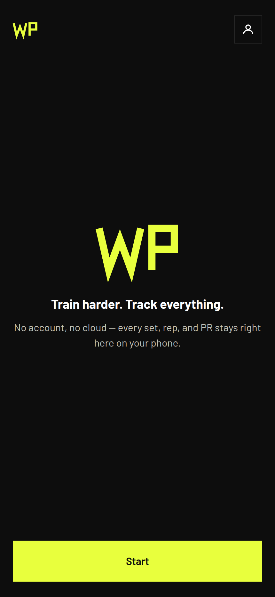
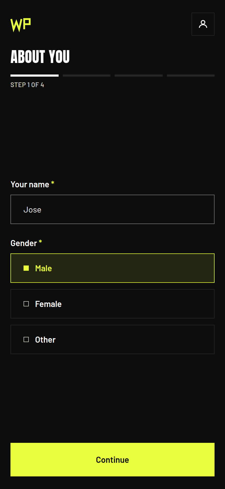
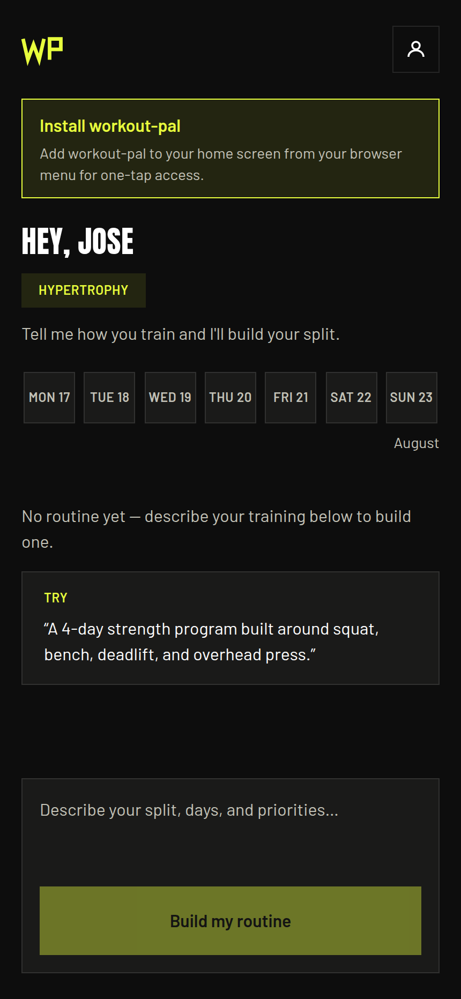
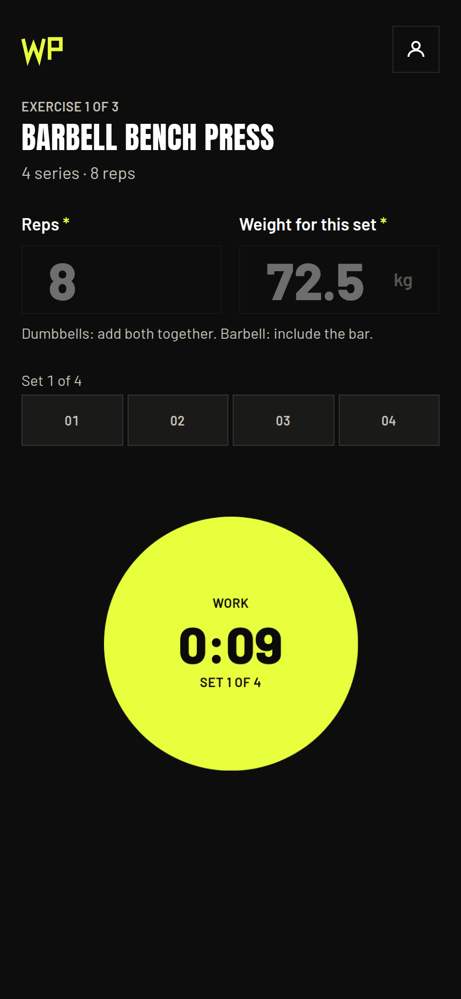
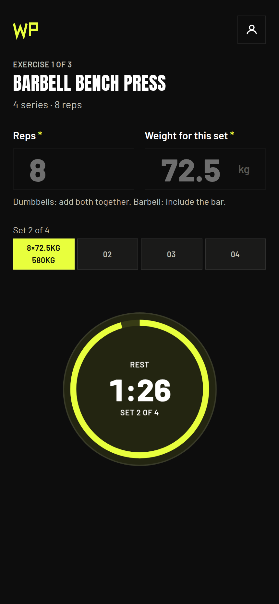

## Problem

Gym apps ask for an account before they show you anything, then sync your training history to a server you have no reason to trust with it. What I wanted was narrower: a routine that matches how I actually train, and something that counts sets and rest for me while I am holding a phone with chalk on my hands.

The second half is the harder half. Plenty of apps will generate a program. Very few are usable mid-set, one-handed, between two heavy lifts, and none of that works if the app needs a network round trip to advance a timer.

## Approach

Local-first, taken literally. Profile, routines, sessions, and set logs all live in IndexedDB through Dexie. There is no server-side persistence anywhere in the product. The only server code is one stateless Next.js route that forwards a routine prompt to OpenRouter and returns the result, storing nothing. The API key and the model id stay in server-side env, so the client never sees either.

Onboarding is four short steps, each one a single decision: who you are, your basics, your body, your training goal and weekly days. It exists to give the routine generator enough to work with, and to give the calendar a weekly target to measure against.

The division of labor with the LLM is deliberate: **the AI generates structure only, the app owns execution.** It returns exercises, sets, reps, and rest, validated with Zod on the way in. Everything after that (the stopwatch cycling `ready → work → rest → overtime`, per-set weight and reps, volume, session resume after an interruption) is deterministic app code. One active routine at a time, so there is never a question about what today's session is.

## Workout mode

This is the screen that has to work with chalk on your hands, so it is one control: a circle you tap.

A set is armed but still, not running, until reps and weight are in. That is the `ready` phase, and the clock reads 0:00 on purpose: you rack your hands, then tap once and the circle goes solid accent for `work`. Tap again to close the set, and the same circle cools to a draining ring counting your rest down.

The phases are `ready → work → rest → exercise-complete`, with `overtime` derived rather than stored: once the rest countdown passes zero, the same elapsed math goes negative and the circle escalates to the warning color with a text label next to it, since color alone should never carry state.

Three details make it trustworthy under real gym conditions:

- **One clock, and it is `Date.now()`.** The session stores `anchorTs`, the timestamp the current phase began. Every displayed second is recomputed from `anchorTs` and the current time during render. A 250ms interval exists only to force that re-render, so a throttled or backgrounded tab redraws slower but can never drift.
- **Every transition is persisted.** Phase, anchor, entered reps and weight, and the sets completed so far are written to IndexedDB on each tap, so closing the browser mid-set and coming back resumes the exact exercise with the exact elapsed time.
- **Rest comes from the plan.** The day's default rest is the most common `restSeconds` across every prescribed set, ties resolving to the shorter value, falling back to 90 seconds when the plan says nothing.

Each completed set is logged on the tap that ends it: actual reps, the weight used for that set, work seconds, and volume as weight times reps. Weight is canonical kilograms in the record and converted to the user's unit at the seam, so switching to imperial is a display concern and never touches history.

## Architecture

Domain-driven and feature-first, layered inside each feature, with imports strictly downward: `ui → logic → api → types`. One folder per feature (profile-goals, routine-generation, workout-mode, calendar), each with `ui/` client components, `logic/` pure rules plus seam hooks and a Zustand store, `api/` its Dexie repo, and an `index.ts` public barrel that exports seam hooks and public types only. The four inner folders are private; cross-feature access goes through the barrel.

That rule is enforced, not documented. A four-rule architecture firewall built on Biome and dependency-cruiser fails CI on feature isolation breaks, wrong layer direction, non-barrel cross-feature imports, and one security-load-bearing rule: the AI proxy route may never import `shared/db` or any `*Repo`, both of which are browser-only. There is a script whose entire job is to prove that rule still errors as intended.

Offline comes from a Serwist service worker, and the app installs to the home screen as a PWA. Fonts are self-hosted woff2, no CDN. Tests are Vitest with fake-indexeddb and MSW for units and integration, Playwright for end-to-end.

## Tradeoffs

- **IndexedDB instead of an account and a database.** No sync, no multi-device history, and clearing site data means losing everything. In exchange there is no auth, no server to run, and no copy of anyone's training log to leak.
- **A proxy route instead of calling OpenRouter from the client.** It is the one piece of server in a local-first app, and it exists only because shipping an API key to the browser is not an option. Stateless, rate-limited per IP, storing nothing.
- **AI for structure, code for execution.** Letting the model drive the workout would have been less code and much less predictable. A timer that hallucinates rest length is worse than no timer.
- **dependency-cruiser on top of Biome.** A second tool to install and keep current, for constraints Biome cannot express. Worth it: the boundaries are the thing that keeps a solo project from turning into one folder of everything.

## What I'd do differently

- Zustand and Dexie both hold session state, and the seam between them took two passes to settle. Deciding upfront that Dexie is the source of truth and the store is a view over it would have saved the rewrite.
- I shipped the calendar before the workout mode felt right under real gym conditions. Consistency tracking is easy to build and easy to admire; the part that had to be perfect was the one-handed screen you use between sets.

## Links

- Live: [workout-beta-nine.vercel.app](https://workout-beta-nine.vercel.app)
- Source: [github.com/jose-garzon/workout](https://github.com/jose-garzon/workout)
